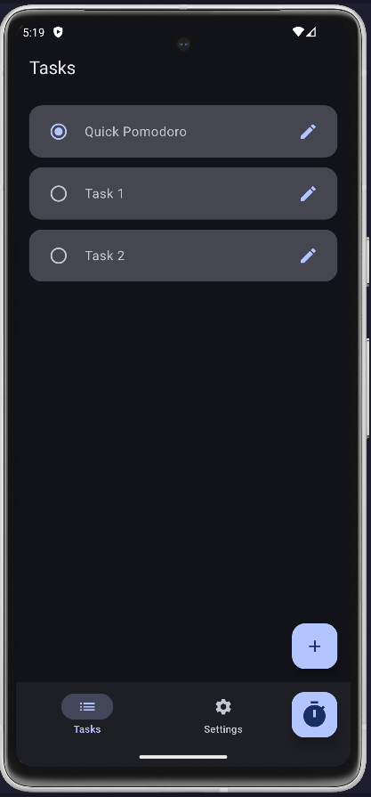
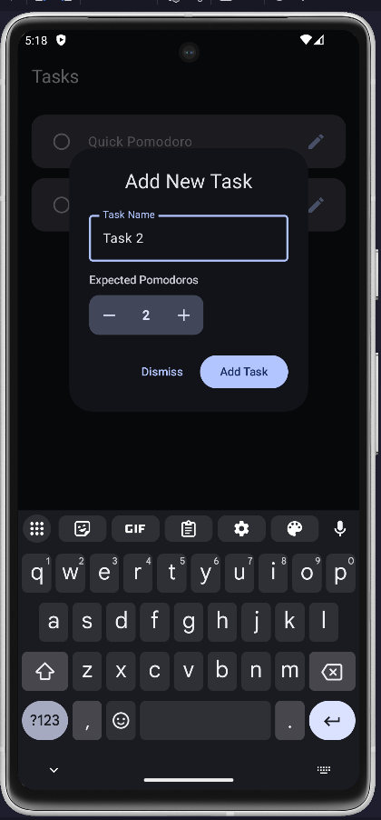
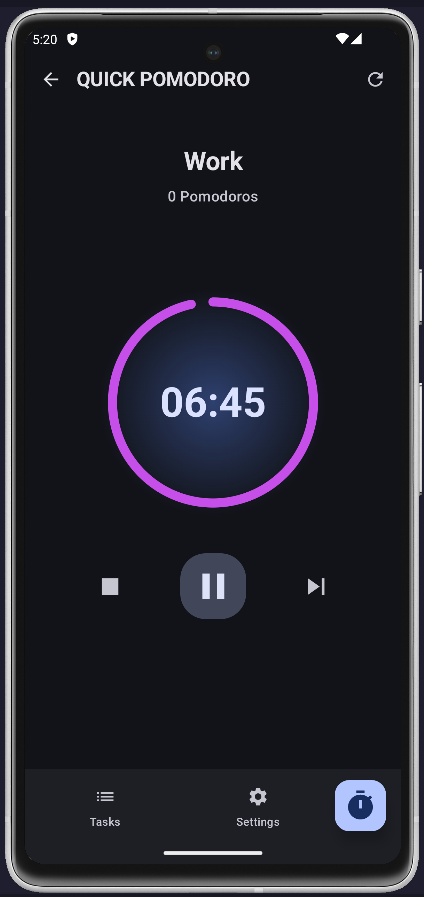
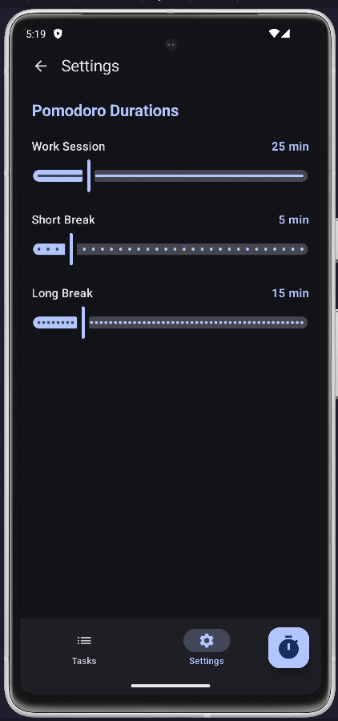

# PomodoSync  

  
  

---

## 📌 Introduction  

**PomodoSync** is a modern Pomodoro timer and task management application for Android.  
The project demonstrates **clean architecture, modern Android development practices, and UI design with Jetpack Compose**.  

It is designed to help users boost productivity by combining the **Pomodoro Technique** with an integrated **task manager**, making work sessions more structured and effective.  

---

## 📱 Screenshots  

<p align="center">
  
  
  
  
</p>

---

## ✨ Features  

- ⏱️ Full **Pomodoro timer** with customizable **work**, **short break**, and **long break** durations.  
- ✅ Integrated **task management** (create, edit, complete tasks).  
- 🔗 Link **Pomodoro sessions to specific tasks** for better tracking.  
- ⚙️ **Settings screen** for customizing session durations.  
- 🌊 A **custom-designed wavy bottom navigation bar** for a unique UI experience.  
- 🎨 Clean **Material 3 UI**, with **light and dark mode** support.  

---

## 🛠️ Tech Stack & Architecture  

- **Language**: Kotlin  
- **UI**: Jetpack Compose, Material 3  
- **Architecture**: MVVM (Model-View-ViewModel) + Repository Pattern  
- **Asynchronous Programming**: Kotlin Coroutines, Flow  
- **Database**: Room (local persistence)  
- **Dependency Injection**: Hilt  
- **Navigation**: Jetpack Navigation Compose  

The app follows **best practices in modern Android development**, ensuring scalability, readability, and maintainability.  

---

## 🚀 Getting Started  

Follow these steps to get the project up and running locally.  

### Prerequisites  
- Android Studio **Giraffe or newer**  
- JDK **11+**  

## 🚀 Future Updates  

Planned enhancements and upcoming features for **PomodoSync**:  

- **Task Management Improvements**  
  - Task sorting by priority, due date, or status  
  - Ability to delete tasks  
  - Show additional task metadata (e.g., created date, completed date)  

- **Pomodoro Enhancements**  
  - More detailed session statistics  
  - History of completed sessions  
  - Improved notifications and reminders  

- **UI/UX**  
  - Enhanced animations and transitions  
  - More customization options for the wavy bottom navigation bar  

*(These updates are part of the roadmap and will be released gradually.)*  


### Installation  

1. Clone the repository:  
   ```bash
   https://github.com/Mohit-sharma-2614/PomodoSync
2. Open the project in Android Studio.

3. Sync Gradle and let dependencies download.

4. Run the app on an emulator or physical device.
